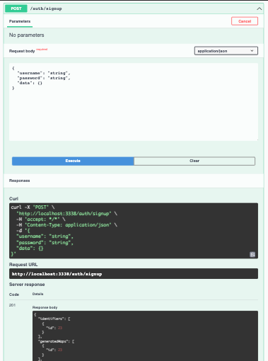

# API

## CONFIGURING THE API

```
AUTHSECRET=
AUTHIGNOREEXPIRATION=true
DATABASE=defaultdb
DBCERT=ca-certificate.crt
DBHOST=db-postgresql-nyc1-337-do-user-1369794-0.b.db.ondigitalocean.com
DBPASSWORD=
DBPORT=25060
DBSYNC=true
DBUSERNAME=doadmin
PORT=7777 # arbitrary choice
```

## DEVELOPING LOCALLY

### STARTING API ON LOCALHOST

`npm run start:dev`

### VIEWING THE API-DOCS

start the server and hit => `http://localhost:7777/api-docs/`

### EXECUTING THE API-DOCS



### CURLING THE API ON LOCALHOST

#### SIGNUP TO CREATE USER

`curl http://localhost:7777/auth/signup -X POST -H 'Content-Type: application/json' -d '{"username": "your.email@here.com", "password": "your-password", "data": {"anything": "here"}}'`

#### SIGNIN TO GET JWT TOKEN

`curl http://localhost:7777/auth/signin -X POST -H 'Content-Type: application/json' -d '{"username": "your.email@here.com", "password": "your-password"}'` 

#### HIT API WITH TOKEN TO RETRIEVE USERS

`curl http://localhost:7777/ -X GET -H 'Authorization: Bearer put-token-hash-here'` 

## CONCEPTS

### AUTH

`@UseGuards(AuthGuard('jwt'))` protects an entire controller or individual methods in a controller depending on where it's invoked 

### BUILDING AND RUNNING DOCKER IMAGE LOCALLY

`docker build -t api .`
`docker run --env-file=.env -p 7777:7777 api`

## MANDATORY CONVENTIONS

- controller routes should always be singular (ex user not users)
- required entity fields should have `@Column` and no question mark so that db insert fails if not provided w/o implementing logic

## TODOS

- add url params to existing controllers
- create base controller
- add bcrypt for local passwords (doesn't really matter yet)
- cors
    - var for UI url
- implement hexagonal/onion arch
    - add modules
        - core-models
        - core-services
